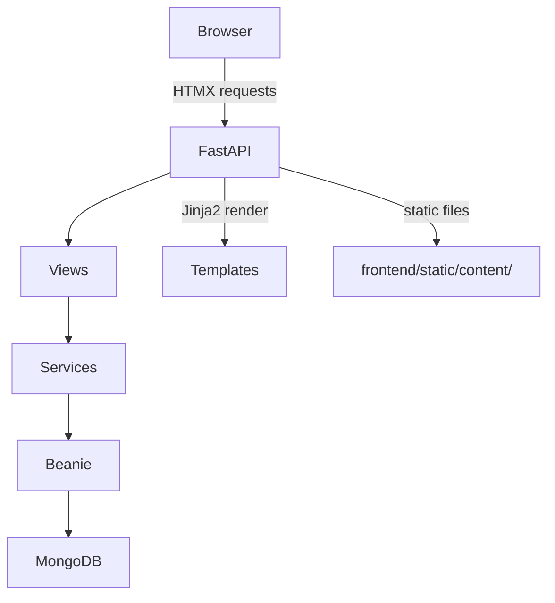

# Get Fluent App — Full Build Plan

## Architecture Overview

**Data model summary:**

- `Tag`: `name`, `slug`, `parent_slug: str | None = None`
- `Card`: `phrase`, `audio_filename`, `created_at`, `tag_slugs: list[str] = []`

Tags optionally carry a `parent_slug` (plain string reference, no DB link). When a tag is added to a card, the full ancestor chain is resolved and **all** slugs in that chain are stored flat in `tag_slugs`. Filtering by a tag is then a simple `{$in: [slug]}` query — no descendant expansion needed.

---

## Phase 1 — Project Scaffold

- **Task 1.1 — `requirements.txt`**: `fastapi`, `uvicorn[standard]`, `jinja2`, `motor`, `beanie`, `python-multipart`, `aiofiles`, `pytest`, `pytest-asyncio`, `httpx`
- **Task 1.2 — `pyproject.toml`**: Ruff config (line-length 88, target-version py311, formatter: double quotes, space indent, no skip-magic-trailing-comma, auto line-endings)
- **Task 1.3 — `pytest.ini`**: asyncio mode = auto, testpaths = tests
- **Task 1.4 — Directory skeleton**: create `models/`, `views/`, `services/`, `tests/`, `frontend/static/content/`, `frontend/templates/partials/`
- **Task 1.5 — `main.py` skeleton**: FastAPI app with `lifespan` (Beanie init), `StaticFiles` mount at `/static`, `Jinja2Templates`, router includes placeholder

---

## Phase 2 — Data Models

Files: `models/tag.py`, `models/card.py`, `models/__init__.py`

- **Task 2.1 — `models/tag.py`**: Beanie `Tag` document with `name: str`, `slug: str`, `parent_slug: str | None = None`, `Settings.name = "tags"`
- **Task 2.2 — `models/card.py`**: Beanie `Card` document with `phrase: str`, `audio_filename: str | None = None`, `created_at: datetime` (default `utcnow`), `tag_slugs: list[str] = []`, `Settings.name = "cards"`
- **Task 2.3 — `models/__init__.py`**: export `Tag`, `Card`; expose `DOCUMENT_MODELS` list used by Beanie init in `main.py`

---

## Phase 3 — Services

Files: `services/tag_service.py`, `services/card_service.py`, `services/audio_service.py`

- **Task 3.1 — `services/tag_service.py` — create**: `async create_tag(name, parent_slug?)` — slugify name, check uniqueness, insert
- **Task 3.2 — `services/tag_service.py` — read**: `async get_all_tags()` flat list; `async build_tag_tree(tags)` pure function returning nested dict for sidebar display
- **Task 3.3 — `services/card_service.py` — create**: `async create_card(phrase, tag_slugs, audio_filename?)` — for each slug walk the `parent_slug` chain to collect all ancestor slugs, deduplicate, insert Card with full flat `tag_slugs` list
- **Task 3.4 — `services/card_service.py` — list/filter**: `async get_cards(tag_slug?)` — if `tag_slug` given, query `{"tag_slugs": {"$in": [tag_slug]}}`; fetch+sort by `created_at` desc
- **Task 3.5 — `services/card_service.py` — search**: `async search_cards(query)` — case-insensitive regex on `phrase`; sort by `created_at` desc
- **Task 3.6 — `services/card_service.py` — delete**: `async delete_card(card_id)` — delete doc, return deleted audio filename (caller deletes file)
- **Task 3.7 — `services/audio_service.py`**: `async save_audio(file: UploadFile) -> str` — generate UUID filename, write to `frontend/static/content/`; `async delete_audio(filename)`

---

## Phase 4 — Views (Route Handlers)

Files: `views/card_views.py`, `views/tag_views.py`, `views/__init__.py`

- **Task 4.1 — `views/card_views.py` — GET `/`**: fetch all tags + cards (newest first), render `index.html`
- **Task 4.2 — `views/card_views.py` — POST `/cards`**: accept `phrase`, `tag_slugs[]`, optional `audio` file upload; call services; return `partials/card_item.html` fragment (HTMX prepend target)
- **Task 4.3 — `views/card_views.py` — GET `/cards`**: accept optional `?tag_slug=` and `?q=`; return `partials/card_list.html` fragment (HTMX swap target)
- **Task 4.4 — `views/card_views.py` — DELETE `/cards/{card_id}`**: delete card + audio; return 200 empty (HTMX removes element)
- **Task 4.5 — `views/tag_views.py` — GET `/tags`**: return all tags as `partials/tag_tree.html` fragment
- **Task 4.6 — `views/tag_views.py` — POST `/tags`**: create tag; return updated `partials/tag_form.html` (with refreshed parent dropdown) + OOB-swap for tag sidebar
- **Task 4.7 — Wire routers in `main.py`**: include `card_router` and `tag_router`

---

## Phase 5 — Templates

Files in `frontend/templates/`

- **Task 5.1 — `base.html`**: HTML shell with Tailwind CDN, HTMX CDN, ``, ``, basic two-column layout slot
- **Task 5.2 — `index.html`**: extends base; left sidebar (tag tree + tag create form), main area (search bar + card form + card list)
- **Task 5.3 — `partials/card_item.html`**: single card — phrase text, tag pills (render the card's `tag_slugs` directly — no ancestry traversal needed), `<audio>` player if audio present, delete button (`hx-delete`, `hx-target="closest .card-item"`, `hx-swap="outerHTML"`)
- **Task 5.4 — `partials/card_list.html`**: `
` wrapper containing a for-loop of `card_item.html` includes; this is the HTMX swap target for search/filter
- **Task 5.5 — `partials/card_form.html`**: multi-select tag picker (checkboxes or `<select multiple>`, `name="tag_slugs"`), phrase textarea, audio file input, `hx-post="/cards"`, `hx-target="#card-list"`, `hx-swap="afterbegin"`
- **Task 5.6 — `partials/tag_tree.html`**: recursive nested `<ul>` of tags built from `build_tag_tree`; each item is a plain button/span (no `<a>`) with `hx-get="/cards?tag_slug=..."`, `hx-target="#card-list"`
- **Task 5.7 — `partials/tag_form.html`**: inline form — tag name input, parent dropdown (option values are slugs), `hx-post="/tags"`, `hx-target="#tag-tree"`, `hx-swap="outerHTML"`
- **Task 5.8 — `partials/search_bar.html`**: `<input>` with `hx-get="/cards"`, `hx-trigger="input changed delay:300ms"`, `hx-target="#card-list"`, `name="q"`

---

## Phase 6 — Tests

Files in `tests/`

- **Task 6.1 — `tests/conftest.py`**: async pytest fixtures — spin up `mongomock_motor` (or `mongomock`) test client, initialise Beanie with test documents, yield client, teardown
- **Task 6.2 — `tests/test_tag_service.py`**: test `create_tag` (with and without parent_slug), `get_all_tags`, `build_tag_tree`
- **Task 6.3 — `tests/test_card_service.py`**: test `create_card` (verify ancestor slugs are stored), `get_cards` (date order), `get_cards` with tag_slug filter, `search_cards`, `delete_card`
- **Task 6.4 — `tests/test_views.py`**: `httpx.AsyncClient` smoke tests — GET `/` returns 200, POST `/cards` returns fragment, GET `/cards?q=` returns fragment, DELETE `/cards/{id}` returns 200
